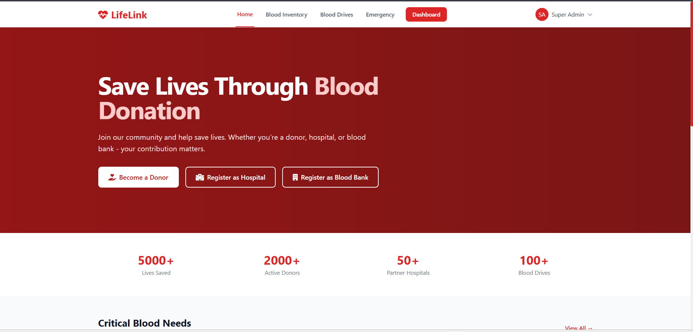
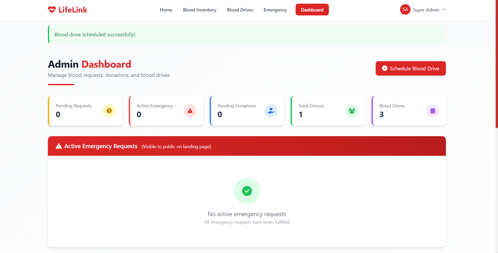
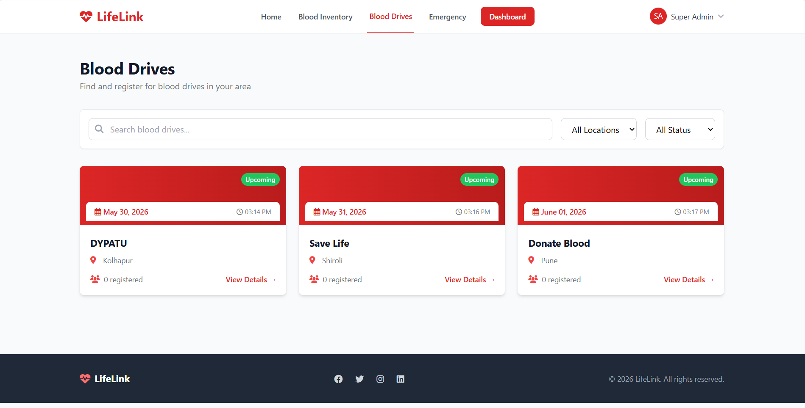
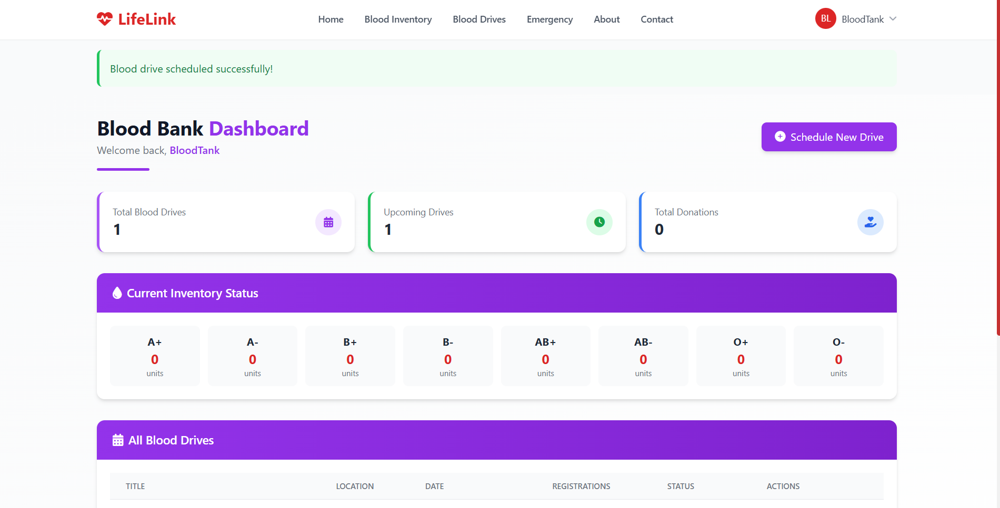

# 🩸 LifeLink - Blood Donation System

LifeLink is a modern, responsive web application designed to streamline blood donation management and emergency blood requests. The system connects donors, hospitals, and blood banks in real-time to ensure efficient blood resource management.

## 📸 Screenshots

### Home Page


### Admin Dashboard



### Blood Drives



### Blood Bank Dashboard



## Features

- Real-time emergency blood request system
- Donor management and scheduling
- Blood bank inventory tracking
- Modern, responsive UI with animations
- Interactive dashboard for all user types (Admin, Donor, Hospital, Blood Bank)
- Multi-role authentication with Flask-Login

## Tech Stack

| Category       | Technology                         |
| -------------- | ---------------------------------- |
| Backend        | Python, Flask                      |
| Frontend       | JavaScript, TailwindCSS, Alpine.js |
| Database       | SQLAlchemy                         |
| Authentication | Flask-Login                        |

## Setup Instructions

```bash
# 1. Create virtual environment
python -m venv venv
venv\Scripts\activate     # On Windows
source venv/bin/activate  # On Mac/Linux

# 2. Install dependencies
pip install -r requirements.txt

# 3. Initialize database
python init_db.py

# 4. Run application
python run.py
```

````

Open browser at: `http://127.0.0.1:5000`

## Project Structure

```
lifelink/
├── app/
│   ├── models/          # Database models
│   ├── routes/          # Route handlers
│   └── templates/       # HTML templates
├── instance/            # Database file
├── config.py            # Configuration
├── init_db.py           # Database setup
├── run.py              # Entry point
└── requirements.txt    # Dependencies
```

## Developed By

**Mohseen Attar**

```

```
````
